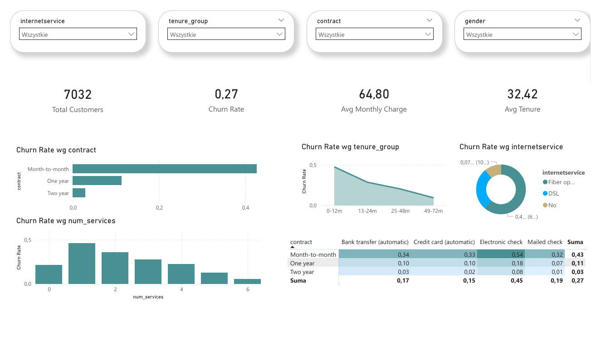

# 📡 Telco Customer Churn Analysis



Analysis of 7,043 telecom customers to identify churn drivers and retention opportunities — built with Python and Power BI.

---

## What was done

- **Cleaned and validated** raw Telco CSV data - fixed data types, removed nulls and duplicates, added assertion checks
- **Engineered 5 new features** - churn binary flag, tenure groups, number of services, avg monthly charge, high-value flag
- **Explored churn drivers** - contract type, payment method, internet service, senior citizen status
- **Segmented customers** by tenure into 4 groups and compared revenue and churn across them
- **Detected anomalies** in monthly charges using the IQR method
- **Analysed service adoption** - identified which add-ons (Online Security, Tech Support) reduce churn most
- **Built a Power BI dashboard** with KPI cards, slicers, bar charts, donut chart, and a contract × payment heatmap

---

## Key findings

- Month-to-month + electronic check customers churn at the highest rate (~42%)
- Customers with more services churn significantly less - bundling is a retention lever
- New customers (0–12 months) are the highest churn risk - early engagement matters
- Long-term customers rarely churn and generate the most total revenue

---

## Stack

`Python` `pandas` `matplotlib` `seaborn` `SQLite` `Power BI`

---

## How to run

```bash
pip install pandas numpy matplotlib seaborn
```

Run `data_cleaning.ipynb` first, then `analysis.ipynb`.  
Open `telco_churn.pbix` in [Power BI Desktop](https://powerbi.microsoft.com/desktop) (free) and point the data source to `data/processed/cleaned_telco.csv`.